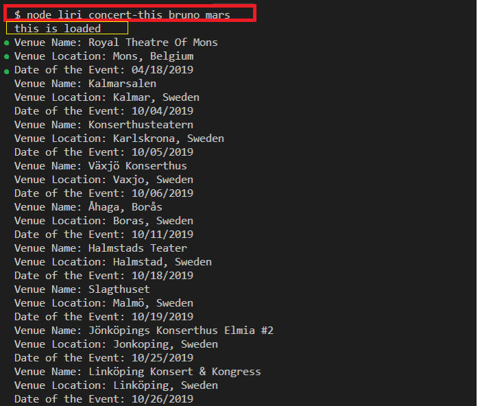
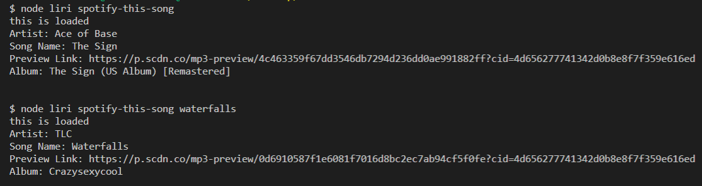
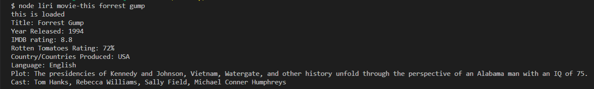
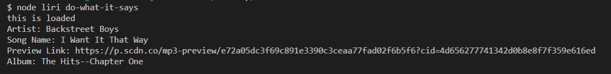
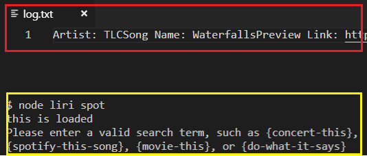

# liri-node-app
LIRI will search Spotify for songs, Bands in Town for concerts, and OMDB for movies through specific console commands.

Before the program is run, packages must be installed by typing "npm install <program>"
  
The packages included are:
* [Node.js] (https://nodejs.org/en/)
* [Node-File-System] (https://nodejs.org/api/fs.html)
* [Axios] (https://www.npmjs.com/package/axios)
* [DotEnv] (https://www.npmjs.com/package/dotenv)
* [JavaScript] (https://www.javascript.com/)
* [Moment.js] (https://www.npmjs.com/package/moment)
* [OMDB-API] (http://www.omdbapi.com)
* [Bandsintown-API] (http://www.artists.bandsintown.com/bandsintown-api)
* [Node-Spotify-API] (https://www.npmjs.com/package/node-spotify-api)
  
After navigating to the root folder of the program, one can run console commands to start the program.
Any console command must be prefixed with node liri.js <command> 

Below are demos of commands and explanations of what they are doing.

*  `node liri.js concert-this <artist/band name here>` will search the Bands in Town Artist Events API.

 
 * In red, is "node liri <command> <query>" , which is using nodejs to run the liri.js file. Then, the command is saved as a variable with process.argv[2], and the query is saved with process.argv[3] as variables. The command variable is run through a list of switch cases, and when it is validated by a 'concert-this', it runs a function to use axios to request bandsintown api data, gets keys through the keys.js file (is successful, prints 'this is loaded', in yellow, which all commands do), and then logs/displays a venue,location,date (formatted as "MM/DD/YYYY"), in green.
  
   *   `node liri.js spotify-this-song '<song name here>'`will show the following information about the song in your terminal/bash window
  
  
  
  * If spotify-this-song is inputted without a song name, then it defaults to a song called 'The Sign'. It's doing this by taking in the command through a switch statement, running a function which uses the spotify api to request information, and then logs/prints the artist,song name,preview link, and album. The function  can take a song name inputted by the user, and do the same thing. 

   * `node liri.js movie-this '<movie name here>'`will output the following information to your terminal/bash window:
   
    

  * If movie-this is inputted without a movie name, then it defaults to a movie called 'Mr.Nobody'. It's doing this by taking in the command through a switch statement, running a function which uses the omdb api to request information, and then logs/prints the requested data. The function can take a movie name inputted by the user, and do the same thing. 

   *  `node liri.js do-what-it-says`will take the text inside of random.txt and then use it to call one of LIRI's commands with fs.

    

   This will run `spotify-this-song`(function) for "I Want it That Way," as follows the text in `random.txt`.
   
   * Additionally, every output will be logged into the log-txt file (red), and there is validation for incorrect commands (yellow)
   
   
